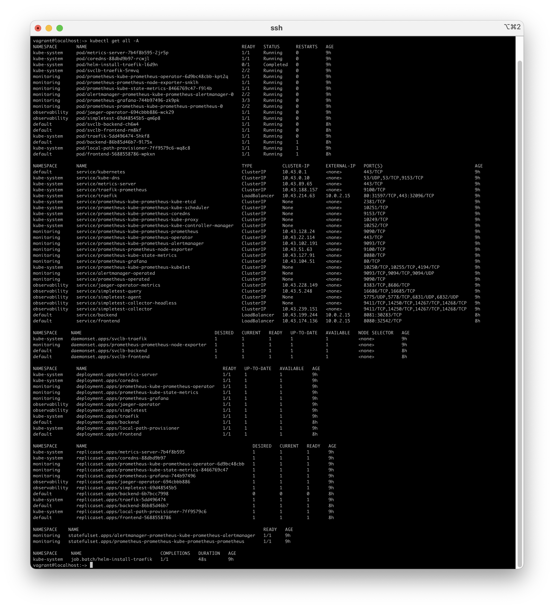
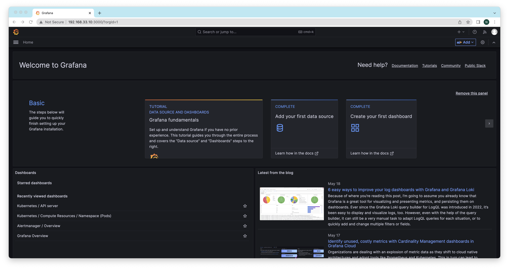
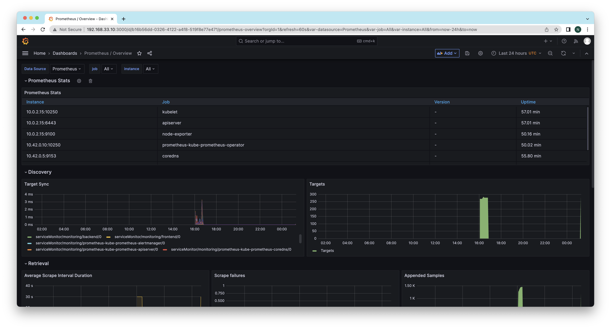
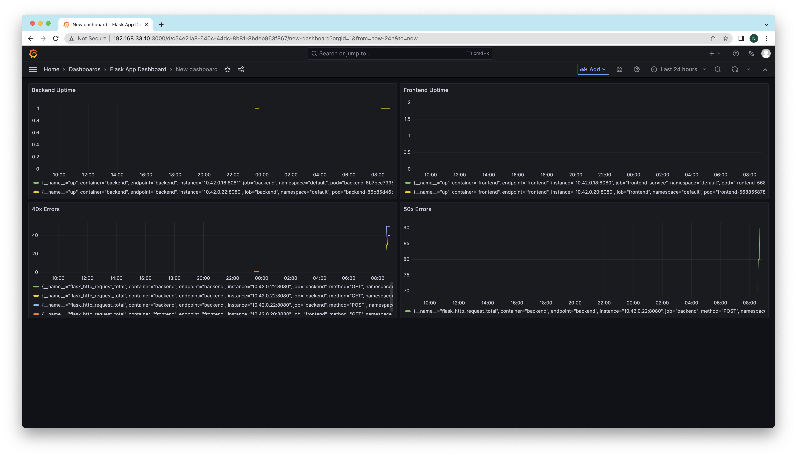
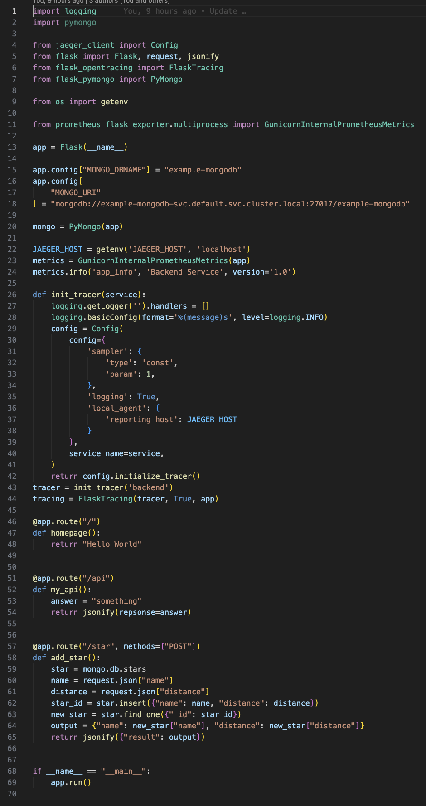
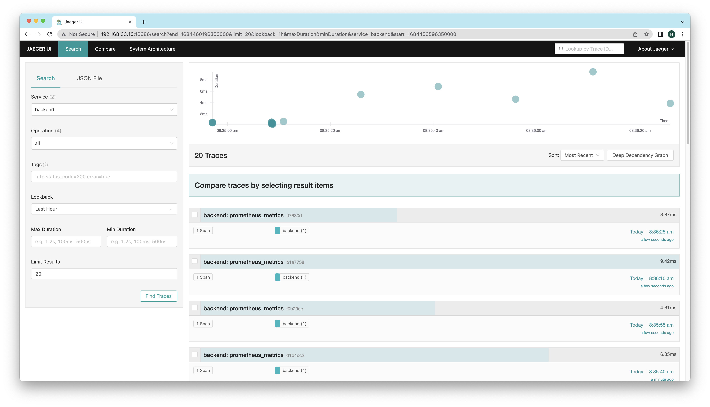
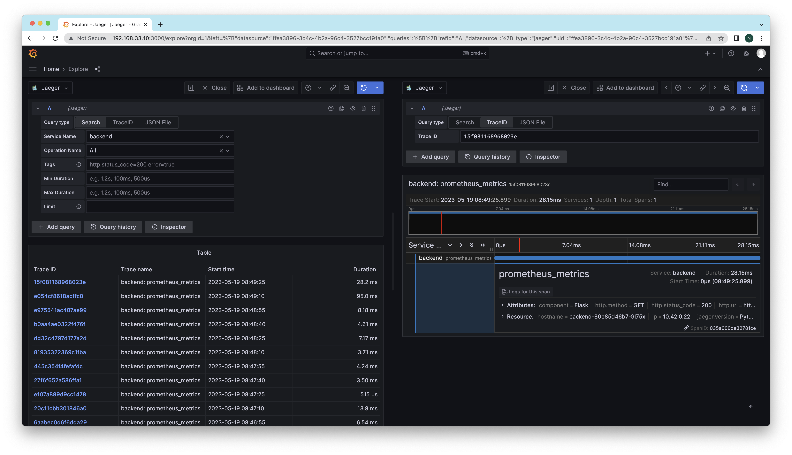
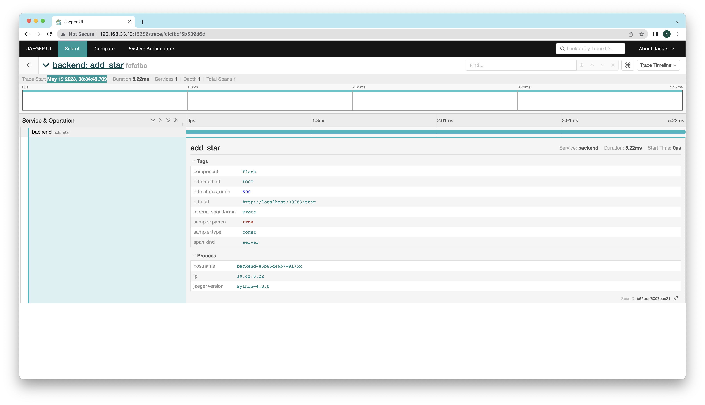

**Note:** For the screenshots, you can store all of your answer images in the `answer-img` directory.

## Verify the monitoring installation

_TODO:_ run `kubectl` command to show the running pods and services for all components. Take a screenshot of the output and include it here to verify the installation

## Setup the Jaeger and Prometheus source

_TODO:_ Expose Grafana to the internet and then setup Prometheus as a data source. Provide a screenshot of the home page after logging into Grafana.

## Create a Basic Dashboard

_TODO:_ Create a dashboard in Grafana that shows Prometheus as a source. Take a screenshot and include it here.

## Describe SLO/SLI

_TODO:_ Describe, in your own words, what the SLIs are, based on an SLO of _monthly uptime_ and _request response time_.

A Service-Level Indicator (SLI) is a specific metric used to measure the performance of a service.

Example:

SLO of _monthly uptime_ and _request response time_:

1. 99.99% uptime in a month
2. 90% of requests will receive a response under 2 seconds in a month

SLIs:

1. Obtain 95% uptime in the previous month
2. 95% of the requests were responded under 2 seconds in the previous month

## Creating SLI metrics.

_TODO:_ It is important to know why we want to measure certain metrics for our customer. Describe in detail 5 metrics to measure these SLIs.

- Latency — The time taken to serve a request (usually measured in ms)
- Traffic — The amount of stress on a system from demand (such as the number of HTTP requests/second)
- Errors — The number of requests that are failing (such as number of HTTP 500 responses)
- Saturation — The overall capacity of a service (such as the percentage of memory or CPU used)
- Uptime - The percentage of time that an app is up and running

## Create a Dashboard to measure our SLIs

_TODO:_ Create a dashboard to measure the uptime of the frontend and backend services We will also want to measure to measure 40x and 50x errors. Create a dashboard that show these values over a 24 hour period and take a screenshot.

## Tracing our Flask App

_TODO:_ We will create a Jaeger span to measure the processes on the backend. Once you fill in the span, provide a screenshot of it here. Also provide a (screenshot) sample Python file containing a trace and span code used to perform Jaeger traces on the backend service.

## Jaeger in Dashboards

_TODO:_ Now that the trace is running, let's add the metric to our current Grafana dashboard. Once this is completed, provide a screenshot of it here.

## Report Error

_TODO:_ Using the template below, write a trouble ticket for the developers, to explain the errors that you are seeing (400, 500, latency) and to let them know the file that is causing the issue also include a screenshot of the tracer span to demonstrate how we can user a tracer to locate errors easily.

TROUBLE TICKET

Name: Ngoc Nguyen

Date: May 19 2023, 08:34:49

Subject: Backend service with add star endpoint shows "500 Internal Server Error"

Affected Area: API add star (POST /star)

Severity: High

Description: The server encountered an internal error and was unable to complete your request. Either the server is overloaded or there is an error in the application. The span is b55bcff6007cee31

## Creating SLIs and SLOs

_TODO:_ We want to create an SLO guaranteeing that our application has a 99.95% uptime per month. Name four SLIs that you would use to measure the success of this SLO.

## Building KPIs for our plan

_TODO_: Now that we have our SLIs and SLOs, create a list of 2-3 KPIs to accurately measure these metrics as well as a description of why those KPIs were chosen. We will make a dashboard for this, but first write them down here.

## Final Dashboard

_TODO_: Create a Dashboard containing graphs that capture all the metrics of your KPIs and adequately representing your SLIs and SLOs. Include a screenshot of the dashboard here, and write a text description of what graphs are represented in the dashboard.
